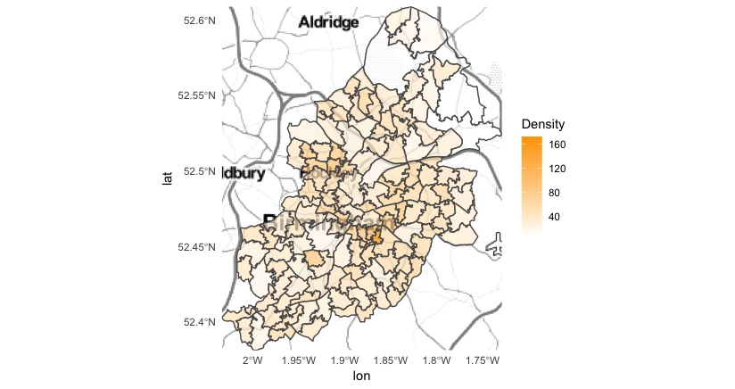

```{r pagkages, include=FALSE}
library(maptools)
library(RColorBrewer)
library(classInt)
library(OpenStreetMap)
library(sp)
library(rgeos)
library(tmap)
library(tmaptools)
library(sf)
library(rgdal)
library(geojsonio)
library(methods)
library(ggplot2)
library(ggmap)
```

## R Markdown

This is an R Markdown document. Markdown is a simple formatting syntax for authoring HTML, PDF, and MS Word documents. For more details on using R Markdown see <http://rmarkdown.rstudio.com>.

When you click the **Knit** button a document will be generated that includes both content as well as the output of any embedded R code chunks within the document. You can embed an R code chunk like this:

```{r code}

getwd()
BirminghamData<- read.csv("/Users/ziyicheng/Desktop/assignment/POP/POPdata.csv", header = TRUE, sep = ",")
datatypelist <- data.frame(cbind(lapply(BirminghamData,class)))
BirminghamData <- data.frame(BirminghamData)
BoroughMapSF <- read_shape("/Users/ziyicheng/Desktop/assignment/BirminghamBoundary/shapefiles/Birmingham_msoa11.shp", as.sf = TRUE)
BoroughDataMap <- append_data(BoroughMapSF,BirminghamData, key.shp = "MSOA11CD", key.data = "GEO_CODE", ignore.duplicates = TRUE)

geom_polygon(aes(x=x, y=y), data.frame)
palette1<-scale_fill_continuous(low="white", high="orange", "Density")
labels<-labs(list(title="Birmingham Population Density",x="Longitude", y="Latitude"))
BoroughMapSF <- st_read("/Users/ziyicheng/Desktop/assignment/BirminghamBoundary/shapefiles/Birmingham_msoa11.shp") %>% st_set_crs(27700)
BoroughMapSFWGS84 <- st_transform(BoroughMapSF, 4326)

BoroughDataMap <- append_data(BoroughMapSFWGS84,BirminghamData, key.shp = "MSOA11CD", key.data = "GEO_CODE", ignore.duplicates = TRUE)
Birminghambbox1 <- c(left = -0.5103766, bottom = 51.28676, right = 0.3340146, top = 51.69187)
Birminghambbox2 <- as.vector(st_bbox(BoroughMapSFWGS84))
map <- get_stamenmap(Birminghambbox2, zoom = 10, maptype = "toner-lite")
ggmap(map) + geom_sf(mapping = aes(geometry=geometry, fill=Population..usual.residents....Density..number.of.persons.per.Hectare....Unit...Persons),data = BoroughDataMap, inherit.aes = FALSE,alpha=0.7)+theme_minimal()+palette1+labels

```

## Output Map
Map1 generated by GUI-based software (ArcGIS)

Map2 generated by code-based software (R)



##Comment:

Geographic information system software works as an effective tool for urban planners and geographers to visualize the geographic data and conduct analysis intuitively. And this report will base on the two maps produced by Arc GIS and R, to compare and evaluate the software with Graphical User Interface(GUI) and Command line interface separately. 

Both of the two maps aim to present the population density distribution in the Birmingham MSOAs. Therefore, the shapefiles of Birmingham MSOAs boundary and the delimited csv files about Birmingham population data should be downloaded from the Consumer Data Research Centre(CDRC) and UK Census Data separately. The workflow of producing the two maps is rather similar, both of the processes contain reading data, manipulating data, analyzing data and final export the results. However, before reading and geocoding the raw data, it should be noted that data clean is the essential step to avoid running into trouble. For ArcGIS, the excel files should be manually edited, while tidyverse package can be utilized in R to clean the data automatically. 

It is conspicuous that the map produced by GUI does well in customizing. All the map components are well arranged, such as map tiles, legends, and scale bar. As for the map produced by R, the customizing style is not intuitive in code and some mapping elements are dismissed because of the size restriction of interface. 

In terms of the applicability, GUI shows its superiority in its user-friendly interface and its extensive function. On the one hand, cartographical operations of GUI provide an easy-to-negative method for users to deal with data, conduct analysis and modify data layout. Especially for beginners, the use of graphical icons and visual indicators in the interface help them be familiar with software quickly. On the other hand, benefit from the quick responding mechanism of GUI, visual feedback can be provided immediately when program runs. Therefore, users are encouraged to test different commands and see different outputs intuitively. In contrast, Command line interface is based on the code and command, and it requires the users to understand certain programming language, which sets a barrier for beginners.

In terms of data manipulation, both GUI and Command line interface support various functions to visualize data. However, benefit from the characteristics of GUI that it allows multiple programs be displayed simultaneously on the interface, it is more effective in producing complex maps with multiple layers such as road network analysis.
On the other hand, R shows its strengths in the reproducible research (Pebesma, Nust & Bivand, 2012). Unlike the components of GUI that they are dependent on the computers’ memory processor, command line interface requires minimal resources, which stimulates the high speed and load efficiency during application. Moreover, because the map-drawing of R is highly dependent on the functions that are supported by CRAN packages, coding can provide a fast way for reproducing outcomes in batch. 

In terms of the compatibility, command line interface is vulnerable especially after upgrading the software to a new version. On most single-user systems such as Mac, Windows and Linux, it is very likely that R cannot find the existing R packages after installing a new version. Besides, the environment setting of R also influenced its operation, it is necessary to adapt its working environment with environment variable of Java to ensure the program run smoothly. Though the errors are often made during the R operation, it is worth mentioning that the generated error and warning information make it clear for users to correct the code. In contrast, though the compatibility of GUI is high, when a problem occurred during the application, it is hard to find the error without a hint. 


Reference:
Pebesma, E., Nust, D. & Bivand, R. (2012) ‘The R software environment in reproducible geoscientific research’, Eos, Vol.93, No.16, pp.163-163.
